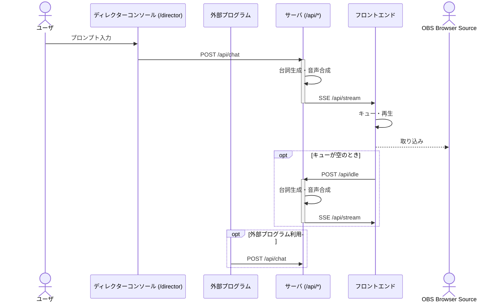

# ai-streamer 概要

ai-streamerは、OpenAIとVOICEVOXを活用し、静止画ベースのVTuber実況配信を自動化するシステムです。OBSのBrowser Sourceとして追加することで、AIによる発話・字幕・表情制御をオールインワンで実現します。

## 特徴
- 静止画によるVTuber実況を自動化
- OBSのソースとして追加し、AIによる発話・字幕・表情制御を一括で実現
- OpenAI APIで台詞生成、VOICEVOXで音声化
- 配信イベントやidleトリガーで自動的に発話・字幕・表情を切り替え
- 設定ファイル（TOML形式）でキャラクターやモデル、表情などを柔軟にカスタマイズ可能

## 使い方
1. リポジトリをクローンし、依存パッケージをインストール
2. `pnpm dev` でサーバ・フロントエンドを起動
3. OBSのBrowser Sourceに `http://localhost:5173` を追加
4. 必要に応じてAPI（`/api/chat` など）を直接叩いて制御も可能

## 技術スタック
- OpenAI（台詞生成、Streaming対応）
- VOICEVOX（音声合成、ずんだもんボイス等）
- Hono（APIサーバ）
- Vite + React（フロントエンド）

## サーバ・フロントエンド間のシーケンス図

### 主なイベント・コマンド
- CONFIGURE: 設定情報の初期送信
- UPDATE_CAPTION: 字幕テキストの更新
- SET_AVATAR: 表情アバターの切り替え
- PLAY_AUDIO: 音声データの再生
- CLEAR_QUEUE: フロント側のキューをクリア

# Development

open -a OBS --args --remote-debugging-port=9222 --remote-allow-origins=http://localhost:9222
