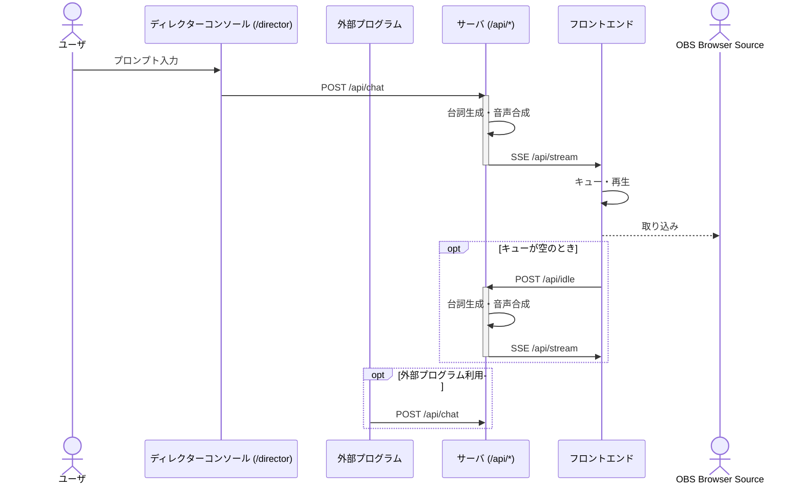

# ai-streamer 概要

ai-streamer は、OpenAI と VOICEVOX を活用し、静止画ベースの VTuber 実況配信を自動化するシステムです。OBS の Browser Source として追加することで、AI による発話・字幕・表情制御をオールインワンで実現します。

## 使い方

1. リポジトリをクローンし、依存パッケージをインストール
2. `pnpm dev` でサーバ・フロントエンドを起動
3. OBS の Browser Source に `http://localhost:5173` を追加
4. 必要に応じて API（`/api/chat` など）を直接叩いて制御も可能

## 技術スタック

- OpenAI（台詞生成、Streaming 対応）
- VOICEVOX（音声合成、ずんだもんボイス等）
- Hono（API サーバ）
- Vite + React（フロントエンド）

## サーバ・フロントエンド間のシーケンス図



## 設定

AI Streamerは`config.js`ファイルで設定をカスタマイズできます。

### ツール機能

発話生成時にAIが外部ツール（Tool Calling）を使用できるようになりました。これにより、AIが時刻を確認したり、アバターを変更したりといった操作を自律的に行えます。

デフォルトで以下のツールが利用可能です：
- `setAvatar`: アバターを変更
- `getTime`: 現在時刻を取得

設定ファイルでカスタムツールを追加することもできます：

```js
export default {
  tools: {
    rollDice: {
      description: "サイコロを振る",
      parameters: {
        sides: {
          type: "number",
          description: "サイコロの面数",
          optional: true,
        },
      },
      handler: "rollDice", // tool-handlers.tsに定義された関数名
    },
  },
};
```

詳細は`configs/config.example-tools.js`を参照してください。

# Development

    open -a OBS --args --remote-debugging-port=9222 --remote-allow-origins=http://localhost:9222
