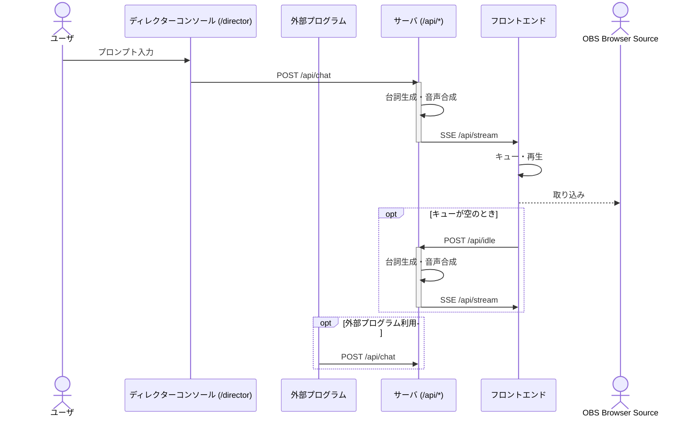

# ai-streamer 概要

ai-streamer は、OpenAI と VOICEVOX を活用し、静止画ベースの VTuber 実況配信を自動化するシステムです。OBS の Browser Source として追加することで、AI による発話・字幕・表情制御をオールインワンで実現します。

## 使い方

1. リポジトリをクローンし、依存パッケージをインストール
2. `pnpm dev` でサーバ・フロントエンドを起動
3. OBS の Browser Source に `http://localhost:5173` を追加
4. 必要に応じて API（`/api/chat` など）を直接叩いて制御も可能

## 技術スタック

- OpenAI（台詞生成、Streaming 対応）
- VOICEVOX（音声合成、ずんだもんボイス等）
- Hono（API サーバ）
- Vite + React（フロントエンド）

## サーバ・フロントエンド間のシーケンス図

# Development

    open -a OBS --args --remote-debugging-port=9222 --remote-allow-origins=http://localhost:9222
