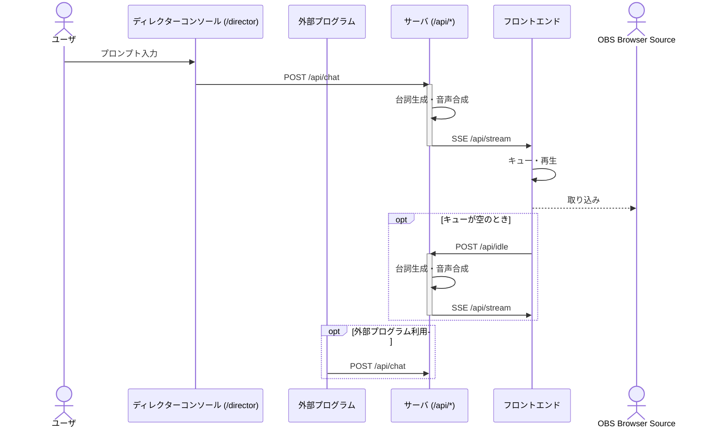

# ai-streamer 概要

ai-streamer は、OpenAI と VOICEVOX を活用し、静止画ベースの VTuber 実況配信を自動化するシステムです。OBS の Browser Source として追加することで、AI による発話・字幕・表情制御をオールインワンで実現します。

## 使い方

### npx経由で起動（推奨）

最も簡単な方法は、npxを使用して直接起動することです：

```bash
npx @motemen/ai-streamer
```

設定ファイルを指定する場合：

```bash
npx @motemen/ai-streamer --config config.example.toml
```

### 開発環境での起動

1. リポジトリをクローンし、依存パッケージをインストール
2. `pnpm dev` でサーバ・フロントエンドを起動
3. OBS の Browser Source に `http://localhost:5173` を追加
4. 必要に応じて API（`/api/chat` など）を直接叩いて制御も可能

## 技術スタック

- OpenAI（台詞生成、Streaming 対応）
- VOICEVOX（音声合成、ずんだもんボイス等）
- Hono（API サーバ）
- Vite + React（フロントエンド）

## サーバ・フロントエンド間のシーケンス図



## 設定

設定ファイルをJSで書けば、AI Streamerの動作をカスタマイズできます。

### ツール機能

発話生成時にAIが外部ツール（Tool Calling）を使用できるようになりました。これにより、AIが時刻を確認したり、アバターを変更したり、計算したりといった操作を自律的に行えます。

デフォルトで以下のツールが利用可能です：
- `setAvatar`: アバターを変更

設定ファイル内でツールを直接定義できます：

```js
import { z } from "zod";

export default {
  tools: {
    // 現在時刻を取得
    getTime: {
      description: "現在の時刻を取得する",
      inputSchema: z.object({}),
      execute: async () => {
        const now = new Date();
        return now.toLocaleString("ja-JP", { timeZone: "Asia/Tokyo" });
      },
    },

    // サイコロを振る
    rollDice: {
      description: "指定された面数のサイコロを振る",
      inputSchema: z.object({
        sides: z.number().default(6).describe("サイコロの面数"),
      }),
      execute: async ({ sides }) => {
        const result = Math.floor(Math.random() * sides) + 1;
        return { result }; // オブジェクトを返す例
      },
    },
  },
};
```

- ツールの`execute`関数のシグネチャは `(params, context) => Promise<any>` です。
  - `params`: `inputSchema`で定義された入力オブジェクトです。
  - `context`: `{ aiStreamer, ... }` のように、`aiStreamer`インスタンスを含むコンテキストオブジェクトです。
- 戻り値は、AIに渡されるJSONシリアライズ可能な任意のオブジェクトです。
- `inputSchema`にはZodスキーマを使用します。

詳細は`configs/config.example-tools.js`を参照してください。

# Development

    open -a OBS --args --remote-debugging-port=9222 --remote-allow-origins=http://localhost:9222
